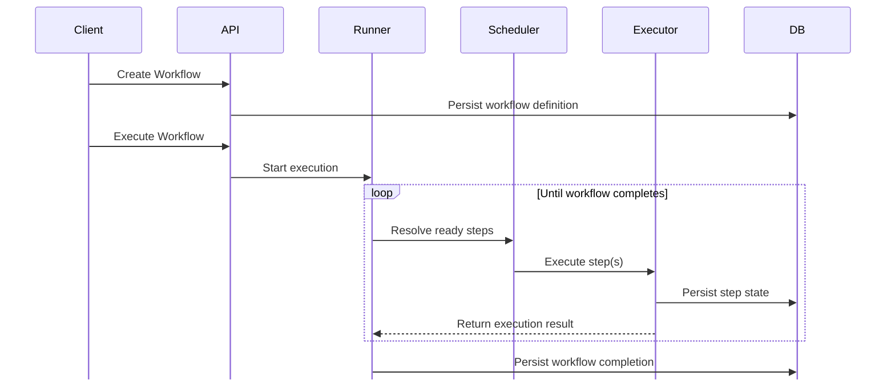
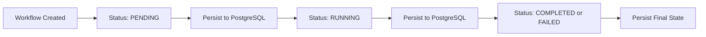
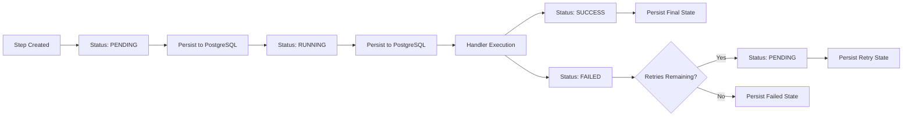
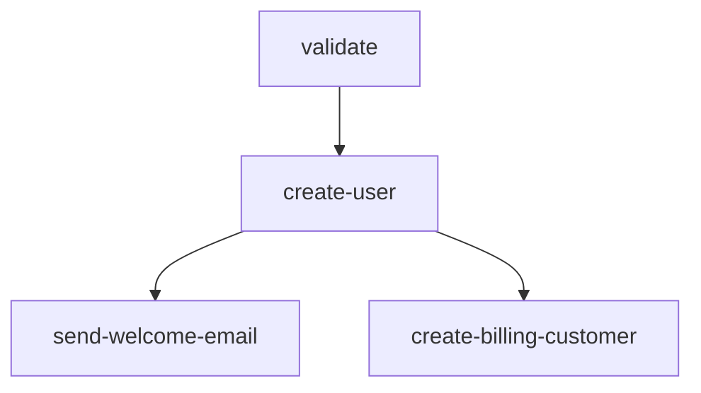

# TaskForge

A durable workflow orchestration engine written in Go. TaskForge executes workflows modeled as Directed Acyclic Graphs (DAGs), persists all state in PostgreSQL, and recovers in-progress workflows after a crash or restart.

> **Single-node only.** TaskForge is not a distributed system — no multi-worker coordination, distributed locking, or leader election. See [Limitations](#limitations).


---

##  Description

TaskForge lets you define a workflow as a set of named steps with explicit dependencies, forming a DAG. When execution is triggered, TaskForge resolves the dependency graph, executes steps in the correct order, persists state transitions to PostgreSQL, and automatically handles retries and crash recovery.

It is a focused backend systems project, intentionally scoped to a single node, that explores workflow orchestration, durable execution, DAG scheduling, and failure recovery concepts.

---

## Features

- **DAG-based workflow definition** with cycle detection via topological sort
- **Durable state persistence** — workflows and steps survive process restarts
- **Retry with exponential backoff** — configurable max attempts, persisted retry state
- **Crash recovery** — stale `RUNNING` steps are reset to `PENDING` on restart
- **Pluggable task handlers** — `dummy`, `delay`, `http` (easily extensible)
- **HTTP task execution** — outbound GET/POST with response persisted as step output
- **REST API** for creating, triggering, and inspecting workflows
- **Docker + Docker Compose** — verified end-to-end including persistence across container restarts

---

## 3. Architecture



| Component | Responsibility |
|-----------|---------------|
| **API Layer** | Accepts workflow definitions, triggers execution, and exposes workflow status |
| **Runner** | Coordinates workflow execution and manages the execution lifecycle |
| **Scheduler** | Resolves workflow dependencies and determines which steps are ready for execution |
| **Executor** | Executes steps, manages state transitions, and invokes task handlers |
| **Storage** | Persists workflow and step state in PostgreSQL |

### Workflow Lifecycle



### Step Lifecycle (with retry)



---

##  Tech Stack

| Layer | Technology |
|---------|------------|
| Language | Go 1.26.3 |
| Database | PostgreSQL 17 |
| Database Driver | lib/pq |
| HTTP Server | net/http |
| Containerization | Docker, Docker Compose |
| Configuration | godotenv |
| ID Generation | google/uuid |
| Development Tooling | Air |

---

##  Project Structure

```
cmd/
  server/           # Application entrypoint and HTTP server bootstrap

internal/
  api/              # HTTP handlers and API request/response models
  executor/         # Task execution, handler dispatch, retries, state transitions
  runner/           # Workflow orchestration and execution coordination
  scheduler/        # Dependency resolution and ready-step selection
  storage/          # PostgreSQL persistence layer
  workflow/         # Core workflow and step models

migrations/         # Database schema definitions
test/               # Integration and workflow tests

```

---

##  Installation & Setup

### Prerequisites

- Go 1.26.3
- PostgreSQL 17 (or Docker)

### Option A — Local Go

```bash
git clone https://github.com/HiteshRahul27/Task-Forge.git
cd Task-Forge
go mod tidy
```

Create the database:

```sql
CREATE DATABASE taskforge;
```

Create a `.env` file:

```env
DB_USER=postgres
DB_PASSWORD=postgres
DB_HOST=localhost
DB_PORT=5432
DB_NAME=taskforge
DB_SSLMODE=disable
```

Initialize the schema:

```bash
psql -U postgres -d taskforge -f migrations/schema.sql
```

Run:

```bash
go run ./cmd/server
# or with hot reload:
air
```

### Option B — Docker Compose (recommended)

```bash
docker compose up --build
```
Initialize the schema:

```bash
docker exec -i taskforge-postgres psql -U postgres -d taskforge < migrations/schema.sql
```

> Replace `postgres` with your PostgreSQL username if different.


Server available at `http://localhost:8080`.

---
##  Example Workflow

The following workflow models a user signup pipeline. After validation, two independent HTTP tasks are triggered to simulate sending a welcome email and creating a billing customer.



```json
{
  "name": "user-signup-pipeline",
  "steps": [
    {
      "id": "validate",
      "type": "dummy",
      "payload": {},
      "dependencies": []
    },
    {
      "id": "create-user",
      "type": "dummy",
      "payload": {},
      "dependencies": ["validate"]
    },
    {
      "id": "send-welcome-email",
      "type": "http",
      "payload": {
        "url": "https://httpbin.org/post",
        "method": "POST",
        "body": "{\"to\":\"user@example.com\",\"template\":\"welcome\"}"
      },
      "dependencies": ["create-user"]
    },
    {
      "id": "create-billing-customer",
      "type": "http",
      "payload": {
        "url": "https://httpbin.org/post",
        "method": "POST",
        "body": "{\"email\":\"user@example.com\"}"
      },
      "dependencies": ["create-user"]
    }
  ]
}
```

Execution order:

```text
validate
    ↓
create-user
    ├── send-welcome-email
    └── create-billing-customer
```

Independent steps become eligible for execution once all their dependencies have completed successfully.
##  API Documentation

[Postman API Documentation](https://documenter.getpostman.com/view/52408813/2sBXwwm7Su)


---

##  Testing

```bash
go test ./...
```

**Manually verified:**
- Workflow creation and persistence
- Dependency ordering
- Retry behavior (exponential backoff)
- Crash recovery (kill mid-execution → restart → resumes)
- Docker deployment and persistence across restarts
- HTTP task execution with response persistence

---

##  Current Status

TaskForge is a functional, single-node workflow engine. The following have been implemented and verified:

| Capability | Status |
|------------|--------|
| DAG execution with dependency resolution | ✅ Done |
| PostgreSQL-backed durable state | ✅ Done |
| Retry with exponential backoff | ✅ Done |
| Crash recovery (timeout-based) | ✅ Done |
| HTTP task handler | ✅ Done |
| Docker Compose deployment | ✅ Done |
| Load testing / benchmarking | ❌ Not yet |
| Full idempotency via ExecutionHash | ❌ Not yet |
| Multi-worker / distributed execution | ❌ Not in scope (yet) |

---

##  Roadmap


- [ ] Execution idempotency
- [ ] Parallel step execution for independent DAG branches
- [ ] Improved crash recovery mechanisms
- [ ] CLI interface
- [ ] Load testing and benchmarking
- [ ] Additional task handlers (database, queues, external integrations)
- [ ] CI pipeline

---

##  Limitations

TaskForge currently has the following limitations:
- **Single-node only.** No multi-worker coordination, distributed locking, or worker claiming. One process runs the entire engine.
- **Crash recovery is timeout-based.** Steps stuck in `RUNNING` past a 5-minute threshold are reset. This is not true liveness detection — it relies on a staleness check, not a process-liveness signal.
- **Execution idempotency is not implemented.** Re-triggering the same workflow is not guaranteed to be a no-op.
- **No load testing performed.** No throughput, latency, or concurrency numbers are published — none are claimed.
- **HTTP-only interaction.** No CLI currently exists.

---

## License

 This project is licensed under the MIT License. See the LICENSE file for details.

---

**Built by [Hitesh Rahul](https://github.com/HiteshRahul27)**